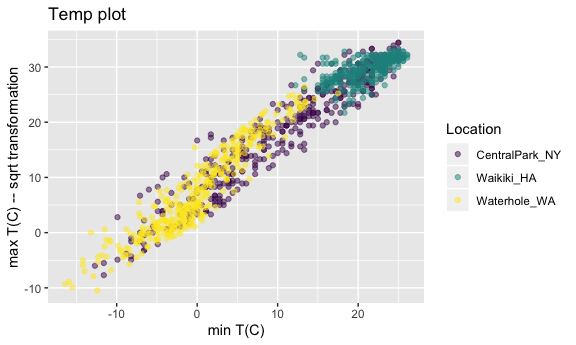
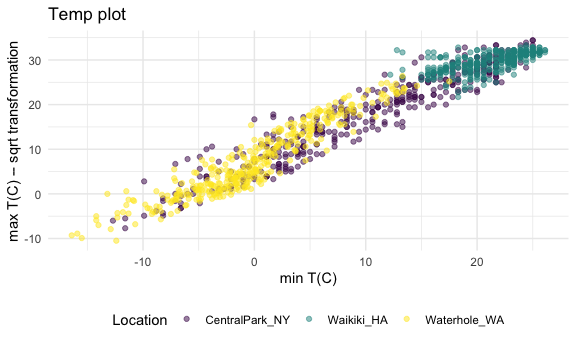
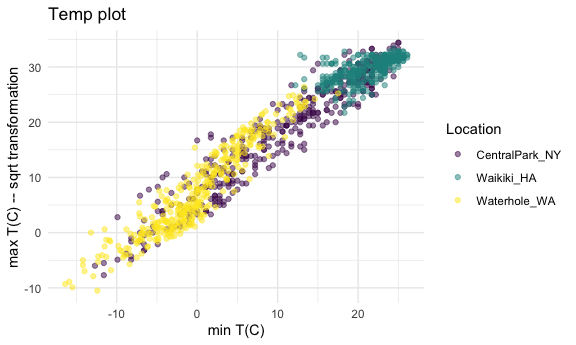
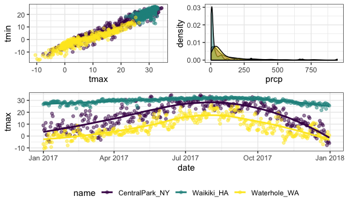

via\_and\_EDA
================
Yuqi Miao
9/26/2019

``` r
library(tidyverse)
```

    ## ── Attaching packages ─────────────────────────────────────── tidyverse 1.3.0 ──

    ## ✔ ggplot2 3.2.1     ✔ purrr   0.3.3
    ## ✔ tibble  2.1.3     ✔ dplyr   0.8.3
    ## ✔ tidyr   1.0.0     ✔ stringr 1.4.0
    ## ✔ readr   1.3.1     ✔ forcats 0.4.0

    ## ── Conflicts ────────────────────────────────────────── tidyverse_conflicts() ──
    ## ✖ dplyr::filter() masks stats::filter()
    ## ✖ dplyr::lag()    masks stats::lag()

``` r
library(ggridges)
```

    ## 
    ## Attaching package: 'ggridges'

    ## The following object is masked from 'package:ggplot2':
    ## 
    ##     scale_discrete_manual

``` r
library(hexbin)
library(patchwork)
library(ggjoy)
```

    ## The ggjoy package has been deprecated. Please switch over to the
    ## ggridges package, which provides the same functionality. Porting
    ## guidelines can be found here:
    ## https://github.com/clauswilke/ggjoy/blob/master/README.md

``` r
weather_df = 
  rnoaa::meteo_pull_monitors(c("USW00094728", "USC00519397", "USS0023B17S"),
                      var = c("PRCP", "TMIN", "TMAX"), 
                      date_min = "2017-01-01",
                      date_max = "2017-12-31") %>%
  mutate(
    name = recode(id, USW00094728 = "CentralPark_NY", 
                      USC00519397 = "Waikiki_HA",
                      USS0023B17S = "Waterhole_WA"),
    tmin = tmin / 10,
    tmax = tmax / 10,
    month = lubridate::floor_date(date, unit = "month")) %>%
  select(name, id, everything())
```

    ## Registered S3 method overwritten by 'crul':
    ##   method                 from
    ##   as.character.form_file httr

    ## Registered S3 method overwritten by 'hoardr':
    ##   method           from
    ##   print.cache_info httr

    ## file path:          /Users/michelle/Library/Caches/rnoaa/ghcnd/USW00094728.dly

    ## file last updated:  2019-09-26 09:58:25

    ## file min/max dates: 1869-01-01 / 2019-09-30

    ## file path:          /Users/michelle/Library/Caches/rnoaa/ghcnd/USC00519397.dly

    ## file last updated:  2019-09-26 09:58:41

    ## file min/max dates: 1965-01-01 / 2019-09-30

    ## file path:          /Users/michelle/Library/Caches/rnoaa/ghcnd/USS0023B17S.dly

    ## file last updated:  2019-09-26 09:58:47

    ## file min/max dates: 1999-09-01 / 2019-09-30

``` r
skimr::skim(weather_df)
```

    ## Skim summary statistics
    ##  n obs: 1095 
    ##  n variables: 7 
    ## 
    ## ── Variable type:character ─────────────────────────────────────────────────────
    ##  variable missing complete    n min max empty n_unique
    ##        id       0     1095 1095  11  11     0        3
    ##      name       0     1095 1095  10  14     0        3
    ## 
    ## ── Variable type:Date ──────────────────────────────────────────────────────────
    ##  variable missing complete    n        min        max     median n_unique
    ##      date       0     1095 1095 2017-01-01 2017-12-31 2017-07-02      365
    ##     month       0     1095 1095 2017-01-01 2017-12-01 2017-07-01       12
    ## 
    ## ── Variable type:numeric ───────────────────────────────────────────────────────
    ##  variable missing complete    n  mean    sd    p0  p25   p50   p75  p100
    ##      prcp       3     1092 1095 33.68 98.51   0   0     0    18    945  
    ##      tmax       3     1092 1095 18.14 11.72 -10.5 7.57 20.55 28.9   34.4
    ##      tmin      15     1080 1095 10.16 10.86 -16.4 0.6  11.4  20.15  26.1
    ##      hist
    ##  ▇▁▁▁▁▁▁▁
    ##  ▁▂▅▃▃▃▅▇
    ##  ▁▂▅▆▃▃▇▇

``` r
ggplot(weather_df, aes(x = tmin, y = tmax))+
    geom_density2d()
```

    ## Warning: Removed 15 rows containing non-finite values (stat_density2d).

<!-- -->

``` r
## first set the canvas and dataset, then draw the map
plot_back = ggplot(weather_df,aes(x = tmin, y = tmax))
plot_back+geom_density2d(aes(color = name),alpha = 0.5)
```

    ## Warning: Removed 15 rows containing non-finite values (stat_density2d).

<!-- -->

``` r
## two different ways to show two dimensional density plot.
plot_back+geom_bin2d(aes(fill = name))
```

    ## Warning: Removed 15 rows containing non-finite values (stat_bin2d).

<!-- -->

``` r
plot_back+geom_hex()
```

    ## Warning: Removed 15 rows containing non-finite values (stat_binhex).

<!-- -->

## basic plots

``` r
plot_back = ggplot(weather_df,aes(x = tmax, y = tmin, color = name))

plot_back + 
  geom_point(alpha = 0.1)+
  geom_smooth()+
  facet_grid(.~name)
```

    ## `geom_smooth()` using method = 'loess' and formula 'y ~ x'

    ## Warning: Removed 15 rows containing non-finite values (stat_smooth).

    ## Warning: Removed 15 rows containing missing values (geom_point).

<!-- -->

## distinguish arguements in or out aes()

``` r
ggplot(weather_df) + geom_point(aes(x = tmin, y = tmax, color = "blue")) ## creating a variable that has value blue everywhere.
```

    ## Warning: Removed 15 rows containing missing values (geom_point).

<!-- -->

``` r
ggplot(weather_df) + geom_point(aes(x = tmin, y = tmax),color = "blue") ## set color as blue by hand.
```

    ## Warning: Removed 15 rows containing missing values (geom_point).

<!-- -->

## univariate plot

Sometimes we need to know the distribution of the variable —- using
histogram, density and boxplot.

``` r
p = ggplot(weather_df)
```

``` r
## histogram

p+geom_histogram(aes(x = tmin,fill = name), position = "dodge")
```

    ## `stat_bin()` using `bins = 30`. Pick better value with `binwidth`.

    ## Warning: Removed 15 rows containing non-finite values (stat_bin).

<!-- -->

``` r
p+geom_histogram(aes(x = tmin, fill = name), position = "stack")
```

    ## `stat_bin()` using `bins = 30`. Pick better value with `binwidth`.

    ## Warning: Removed 15 rows containing non-finite values (stat_bin).

<!-- -->

``` r
## density plot
ggplot(weather_df, aes(x = tmax, fill = name)) + 
  geom_density(alpha = .4, adjust = .5, color = "blue")+ 
  ## adjust is used to adjust the smoothing degree of the curve similar to bin_width.
  geom_rug()
```

    ## Warning: Removed 3 rows containing non-finite values (stat_density).

<!-- -->

``` r
## to show the density plot of multiple variables

### violin plot with error bar
violin_plot = ggplot(weather_df, aes(x = name, y = tmax))+
  geom_violin(aes(fill = name),alpha = 0.5, color = "blue") +
  stat_summary(fun.y = mean,geom = "point", color = "darkblue")+
  stat_summary(fun.ymin = function(y){mean(y)-sd(y)},fun.ymax = function(y){mean(y)+sd(y)}, geom = "errorbar", color = "darkblue")
violin_plot
```

    ## Warning: Removed 3 rows containing non-finite values (stat_ydensity).

    ## Warning: Removed 3 rows containing non-finite values (stat_summary).
    
    ## Warning: Removed 3 rows containing non-finite values (stat_summary).

<!-- -->

``` r
## rotate: ggjoy::geom_joy or ggridges::geom_density_ridges()
density_plot = 
  ggplot(weather_df, aes(x = tmin, y = name, color = name)) +
  geom_joy(scale = 0.5)
density_plot
```

    ## Picking joint bandwidth of 1.67

    ## Warning: Removed 15 rows containing non-finite values
    ## (stat_density_ridges).

<!-- -->

## reproducible export

### save

still with problem in mac, no clue to the device problems.

``` r
# dev.off()
# dev.set(3)
# ggsave("density plot by names", density_plot,width = 8, height = 5)
# ggsave("violin plot with error bar", violin_plot, width = 8, height = 5)
```

## embedding plots

set in the front of all chunks.

``` r
knitr::opts_chunk$set(
  fig.width = 6,
  fig.asp = 0.6,
  out.width = "90%"
)
```

## vis 2

``` r
library(patchwork)
```

### labels

``` r
weather_df %>%
  ggplot(aes(x = tmin, y = tmax, color = name))+
  geom_point(alpha = 0.5)+
  labs(
    title = "Temp plot",
    x = "min T(C)",
    y = "max T(C) -- sqrt transformation"
    ) +
  scale_x_continuous(         ### manipulate the continuous variable ticks
      breaks = c(-15,0,15), ## set the position of ticks
      labels = c("-15C", "0C","15C"), ## set the labels of ticks
      limits = c(-20,20) ## set the range of the axis
    ) +
  scale_y_continuous(         ### or using scale_y_sqrt
    trans = "sqrt",        ## using this to draw transformed variables. 
    position = "right",
    breaks = seq(0,40,by = 10),
    limits = c(0,40)
  )
```

    ## Warning in self$trans$transform(x): NaNs produced

    ## Warning: Transformation introduced infinite values in continuous y-axis

    ## Warning: Removed 360 rows containing missing values (geom_point).


### color

``` r
weather_df %>%
  ggplot(aes(x = tmin, y = tmax, color = name))+
  geom_point(alpha = 0.5)+
  labs(
    title = "Temp plot",
    x = "min T(C)",
    y = "max T(C) -- sqrt transformation"
    ) +
  scale_color_hue(            ### not always do, change merely by hand
    name = "Weather station", ### the name of color legend
    h = c(100,300)           ### control the range of color
  )
```

    ## Warning: Removed 15 rows containing missing values (geom_point).


### virdirs package

``` r
ggbase <-                                         ### add a baseplot to add things
  weather_df %>%
  ggplot(aes(x = tmin, y = tmax, color = name))+
  geom_point(alpha = 0.5)+
  labs(
    title = "Temp plot",
    x = "min T(C)",
    y = "max T(C) -- sqrt transformation"
    ) + 
  viridis::scale_color_viridis(
    name = "Location", 
    discrete = TRUE  ## set to discrete variables  
  )

ggbase
```

    ## Warning: Removed 15 rows containing missing values (geom_point).



``` r
ggbase_2 <- 
  weather_df %>% 
  ggplot(aes(x = tmin,fill = name)) +
  geom_histogram()+
  viridis::scale_fill_viridis(
    name = "location",
    discrete = TRUE
  )
ggbase_2
```

    ## `stat_bin()` using `bins = 30`. Pick better value with `binwidth`.

    ## Warning: Removed 15 rows containing non-finite values (stat_bin).


## legend position

``` r
ggbase +                      ## theme setting using theme_*() will overlap the other settings, custom setting needs to be the bottome.
  theme_minimal() +
  theme(legend.position = "bottom")
```

    ## Warning: Removed 15 rows containing missing values (geom_point).



``` r
ggbase +
  theme(legend.position = "bottom") + ## order mattered!!
  theme_minimal()
```

    ## Warning: Removed 15 rows containing missing values (geom_point).



``` r
## use theme(legend.position = "none") to remove the legend
```

## update initial setting

``` r
knitr::opts_chunk$set(
  fig.width = 6,
  fig.asp = 0.6,
  out.width = "90%"
)

options(
  ggplot2.continuous.colour = "viridis",
  ggplot2.continuous.fill = "viridis")

scale_colour_discrete = scale_colour_viridis_d
scale_fill_discrete = scale_fill_viridis_d

theme_set(theme_bw() + theme(legend.position = "bottom"))
```

## more than one dataset

``` r
central_park = 
  weather_df %>% 
  filter(name == "CentralPark_NY")

waikiki = 
  weather_df %>% 
  filter(name == "Waikiki_HA")

ggplot(data = waikiki, aes(x = date, y = tmax, color = name)) + 
  geom_point() + 
  geom_line(data = central_park)                  ### specify the geom_specific dataset
```

    ## Warning: Removed 3 rows containing missing values (geom_point).


(brief aside about colors)

``` r
waikiki %>%
  ggplot(aes(x = date, y  = tmax))+
  geom_point(color = "blue")
```

    ## Warning: Removed 3 rows containing missing values (geom_point).


when creating a summarise plot, firstly create a summary table where
contains all the data we used in the overlapped complete plot. Think
about the constructure and goal of the complete plot before drawing.

## patch work

``` r
tmax_tmin_p = 
  weather_df %>% 
  ggplot(aes(x = tmax, y = tmin, color = name)) + 
  geom_point(alpha = .5) +
  theme(legend.position = "none")

prcp_dens_p = 
  weather_df %>% 
  filter(prcp > 0) %>% 
  ggplot(aes(x = prcp, fill = name)) + 
  geom_density(alpha = .5) + 
  theme(legend.position = "none")

tmax_date_p = 
  weather_df %>% 
  ggplot(aes(x = date, y = tmax, color = name)) + 
  geom_point(alpha = .5) +
  geom_smooth(se = FALSE) + 
  theme(legend.position = "bottom")

(tmax_tmin_p + prcp_dens_p) / tmax_date_p  ## patchwork！
```

    ## Warning: Removed 15 rows containing missing values (geom_point).

    ## `geom_smooth()` using method = 'loess' and formula 'y ~ x'

    ## Warning: Removed 3 rows containing non-finite values (stat_smooth).

    ## Warning: Removed 3 rows containing missing values (geom_point).



## data manipulation

using data manipulation to make the data structure more clear, then
making plot.

``` r
weather_df %>%
  mutate(name = forcats::fct_relevel(name, c("Waikiki_HA", "CentralPark_NY", "Waterhole_WA"))) %>% 
  ggplot(aes(x = name, y = tmax)) + 
  geom_violin(aes(fill = name), color = "blue", alpha = .5) + 
  theme(legend.position = "bottom")
```

    ## Warning: Removed 3 rows containing non-finite values (stat_ydensity).


### reorder

``` r
weather_df %>%
  drop_na() %>% 
  mutate(name = forcats::fct_reorder(name, tmax, mean,.desc = TRUE)) %>% 
  ## use second variable to assign the plotting order
  ## third var to set the function to manipulate key var
  ggplot(aes(x = name, y = tmax)) +  ## to change the layer order, change the dataframe arrange order!
  geom_violin(aes(fill = name), color = "blue", alpha = .5) + 
  theme(legend.position = "bottom")
```


``` r
weather_df %>% 
  drop_na() %>% 
  group_by(name) %>% 
  summarise(median = median(tmax),mean = mean(tmax)) %>% 
  arrange(median)
```

    ## # A tibble: 3 x 3
    ##   name           median  mean
    ##   <chr>           <dbl> <dbl>
    ## 1 Waterhole_WA      5.5  7.48
    ## 2 CentralPark_NY   18.3 17.4 
    ## 3 Waikiki_HA       30   29.6

After setting the goal of the plot, make new datasets to show the
plots\!

``` r
weather_df %>%
  select(name, tmax, tmin) %>%  ## setting the color to a factor variable
  pivot_longer(  
    tmax:tmin,
    names_to = "observation", 
    values_to = "temp") %>% 
  ggplot(aes(x = temp, fill = observation)) +
  geom_density(alpha = .5) + 
  facet_grid(~name)
```

    ## Warning: Removed 18 rows containing non-finite values (stat_density).


## examples

1.  imports and tidies the PULSE data, and creates a plot showing BDI
    score across
visits.

<!-- end list -->

``` r
pulse_data = haven::read_sas(data_file = "data/public_pulse_data.sas7bdat") %>% 
  janitor::clean_names() 
pulse_visit = pulse_data %>% 
  pivot_longer(
    bdi_score_bl:bdi_score_12m,
    names_to = "visit",
    names_prefix = "bdi_score_",
    values_to = "bdi",
  ) %>% 
  select(id,visit,bdi) %>% 
  mutate(
    visit = recode(visit,"bl"="00m"),
    visit = forcats::fct_relevel(visit,c("00m","01m","06m","12m"))
    )
  
ggplot(pulse_visit,aes(x = visit, y = bdi))+
  geom_boxplot()
```

    ## Warning: Removed 879 rows containing non-finite values (stat_boxplot).


2.  pup-level
visulization

<!-- end list -->

``` r
pup_data = read_csv(file = "data/FAS_pups.csv", col_types = "ciiiii") %>% 
  janitor::clean_names() %>% 
  mutate(sex = recode(sex, "1" = "male","2" = "female"))

litters = read_csv("data/FAS_litters.csv",col_types = "ccddiiii") %>% 
  janitor::clean_names() %>% 
  select(-pups_survive) %>% 
  separate(col = group, into = c("dose","day_of_tx"), sep = 3) %>% 
  mutate(
    dose = factor(dose),
    wt_gain = gd18_weight - gd0_weight,
    day_of_tx = as.numeric(day_of_tx)
  )
  
fas_data = left_join(pup_data, litters, by = "litter_number")
fas_data %>% 
  select(sex,dose, day_of_tx, pd_ears:pd_walk) %>% 
  pivot_longer(
    pd_ears:pd_walk,
    names_to = "outcome",
    values_to = "pn_days",
    names_prefix = "pd_"
  ) %>% 
  drop_na() %>%
  mutate(
    outcome = forcats::fct_reorder(outcome,pn_days,median),
    dose = forcats::fct_reorder(dose,pn_days,median)
  ) %>% 
  ggplot(aes(x = dose, y = pn_days)) +
  geom_violin() +
  facet_grid(day_of_tx~outcome)
```


## group\_by

``` r
weather_df %>% 
  group_by(name,month) %>% 
  summarise(n_obs = n())
```

    ## # A tibble: 36 x 3
    ## # Groups:   name [3]
    ##    name           month      n_obs
    ##    <chr>          <date>     <int>
    ##  1 CentralPark_NY 2017-01-01    31
    ##  2 CentralPark_NY 2017-02-01    28
    ##  3 CentralPark_NY 2017-03-01    31
    ##  4 CentralPark_NY 2017-04-01    30
    ##  5 CentralPark_NY 2017-05-01    31
    ##  6 CentralPark_NY 2017-06-01    30
    ##  7 CentralPark_NY 2017-07-01    31
    ##  8 CentralPark_NY 2017-08-01    31
    ##  9 CentralPark_NY 2017-09-01    30
    ## 10 CentralPark_NY 2017-10-01    31
    ## # … with 26 more rows

``` r
weather_df %>%
  pull(month) %>% 
  table
```

    ## .
    ## 2017-01-01 2017-02-01 2017-03-01 2017-04-01 2017-05-01 2017-06-01 
    ##         93         84         93         90         93         90 
    ## 2017-07-01 2017-08-01 2017-09-01 2017-10-01 2017-11-01 2017-12-01 
    ##         93         93         90         93         90         93

## (2x2 tables)

## General summaries

``` r
weather_df %>%
  group_by(month) %>%
  summarize(
    mean_tmax = mean(tmax),
    mean_prec = mean(prcp, na.rm = TRUE),
    median_tmax = median(tmax),
    sd_tmax = sd(tmax))
```

    ## # A tibble: 12 x 5
    ##    month      mean_tmax mean_prec median_tmax sd_tmax
    ##    <date>         <dbl>     <dbl>       <dbl>   <dbl>
    ##  1 2017-01-01      10.8     37.0          6.1   13.1 
    ##  2 2017-02-01      12.2     57.9          8.3   12.1 
    ##  3 2017-03-01      13.0     54.6          8.3   12.4 
    ##  4 2017-04-01      17.3     32.9         18.3   11.2 
    ##  5 2017-05-01      NA       28.4         NA     NA   
    ##  6 2017-06-01      23.5     18.7         27.2    8.73
    ##  7 2017-07-01      NA       12.7         NA     NA   
    ##  8 2017-08-01      26.3     10.2         27.2    5.87
    ##  9 2017-09-01      23.8      9.94        26.1    8.42
    ## 10 2017-10-01      20.1     41.5         22.2    9.75
    ## 11 2017-11-01      14.0     61.5         12.0   11.6 
    ## 12 2017-12-01      11.0     40.2          8.9   11.9

## Grouped mutate

``` r
weather_df %>%
  group_by(name) %>%
  mutate(centered_tmax = tmax - mean(tmax)) %>% 
  ggplot(aes(x = date, y = centered_tmax, color = name)) + 
    geom_point() 
```

    ## Warning: Removed 365 rows containing missing values (geom_point).


## Window functions
